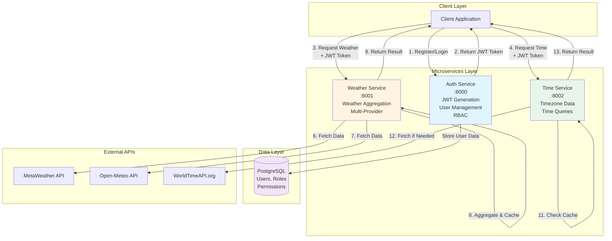
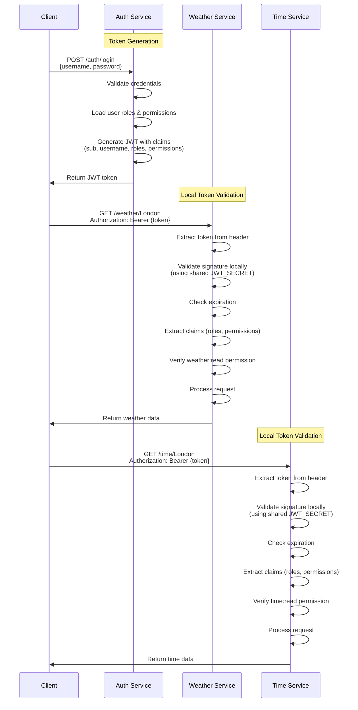
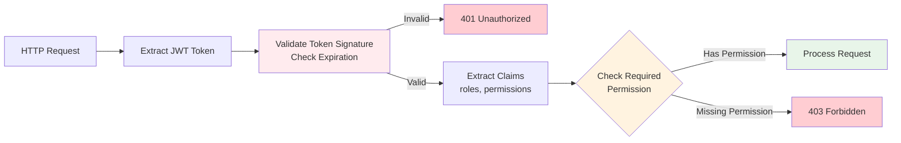
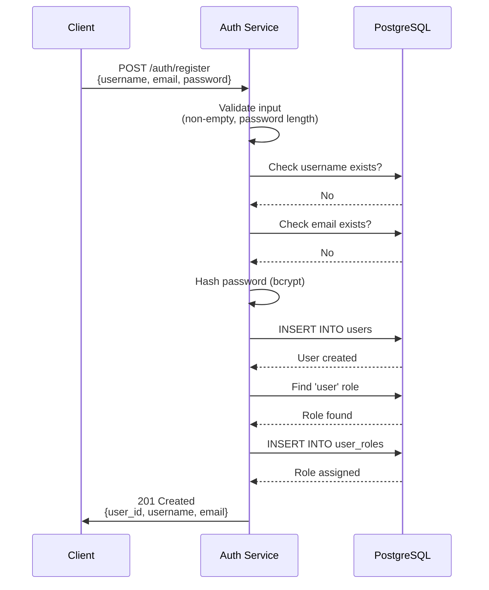
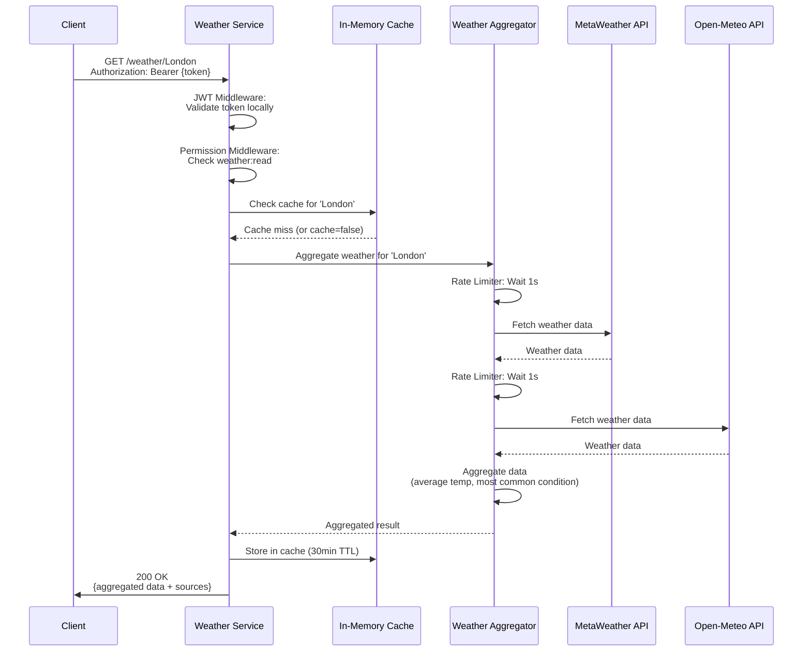
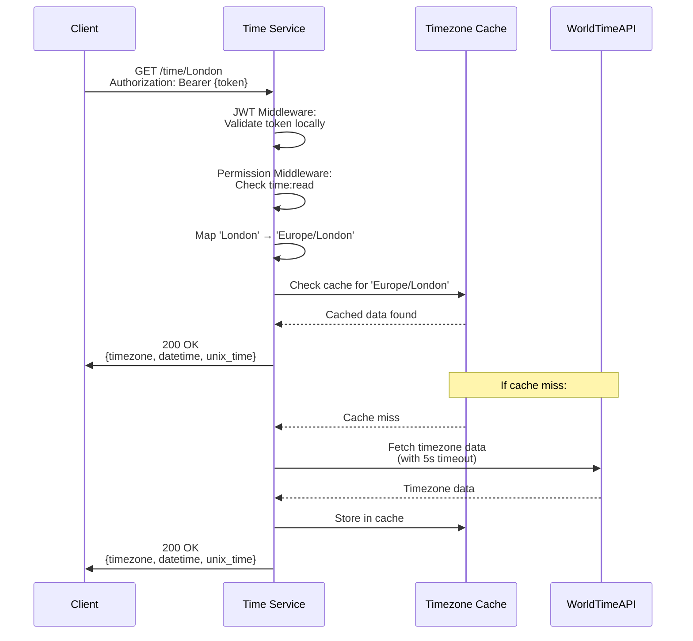
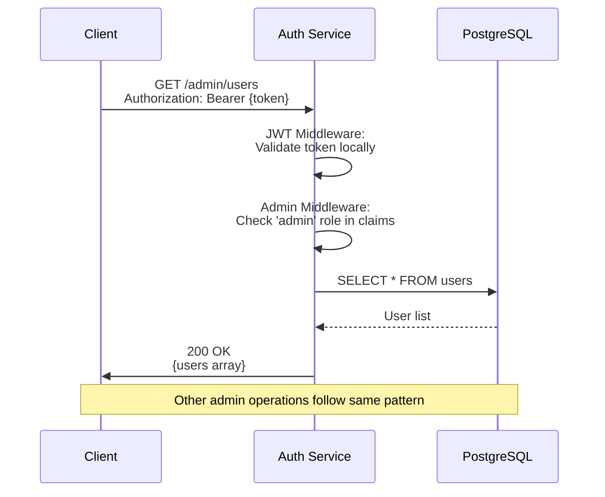
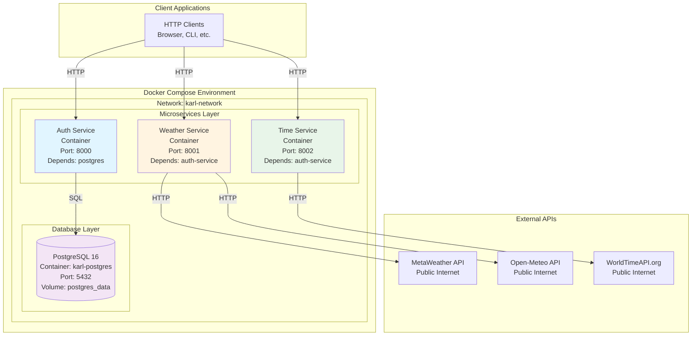

# Architecture Documentation

## Table of Contents

- [System Overview](#system-overview)
- [High-Level Architecture](#high-level-architecture)
- [Detailed Component Architecture](#detailed-component-architecture)
- [Service Responsibilities](#service-responsibilities)
- [Authentication & Authorization Flow](#authentication--authorization-flow)
- [Request Flow Diagrams](#request-flow-diagrams)
- [Deployment Architecture](#deployment-architecture)
- [Technology Stack](#technology-stack)
- [Scalability & Performance](#scalability--performance)
- [Security Considerations](#security-considerations)

---

## System Overview

This project implements a microservices architecture with three separate services that communicate to achieve a common goal:

1. **Auth Service** - Authentication and user management with RBAC (Role-Based Access Control)
2. **Weather Service** - Aggregates weather data from multiple providers
3. **Time Service** - Provides current time for cities with second accuracy

### Key Design Principles

- **Stateless Services**: All services are stateless (except in-memory caches)
- **Local JWT Validation**: Services validate JWT tokens locally using shared secret (no service-to-service calls)
- **Permission-Based Access Control**: Fine-grained permissions enforced at the service level
- **Resilient Caching**: In-memory caching with background refresh reduces external API dependencies

---

## High-Level Architecture

This diagram shows the overall system architecture and communication patterns.

**Key Points:**
- Services validate JWT tokens locally using shared secret (no HTTP calls to Auth Service)
- Each service enforces its own permission requirements
- External API calls are rate-limited and cached
- Services operate independently and can scale horizontally

---

## Detailed Component Architecture

This diagram shows the internal components and middleware layers of each service.

```mermaid
graph TB
    subgraph "Auth Service :8000"
        AuthAPI[HTTP API Layer]
        AuthJWT[JWT Middleware]
        AuthAdmin[Admin Middleware]
        AuthHandlers[Request Handlers]
        AuthServices[Services Layer<br/>- JWT Generation<br/>- Password Hashing<br/>- User Management]
        AuthDB[(PostgreSQL<br/>Connection Pool)]
    end
    
    subgraph "Weather Service :8001"
        WeatherAPI[HTTP API Layer]
        WeatherJWT[JWT Middleware<br/>Local Validation]
        WeatherPerm[Permission Middleware<br/>weather:read]
        WeatherHandlers[Request Handlers]
        WeatherCache[In-Memory Cache<br/>DashMap<br/>30min TTL]
        WeatherAgg[Weather Aggregator<br/>- Rate Limiter<br/>- Multi-Provider]
        WeatherProviders[Provider Clients<br/>- MetaWeather<br/>- Open-Meteo]
    end
    
    subgraph "Time Service :8002"
        TimeAPI[HTTP API Layer]
        TimeJWT[JWT Middleware<br/>Local Validation]
        TimePerm[Permission Middleware<br/>time:read]
        TimeHandlers[Request Handlers]
        TimeCache[Timezone Cache<br/>Arc&lt;RwLock&gt;<br/>Pre-populated<br/>Hourly Refresh]
        TimeClient[WorldTimeAPI Client]
    end
    
    AuthAPI --> AuthJWT
    AuthJWT --> AuthAdmin
    AuthAdmin --> AuthHandlers
    AuthHandlers --> AuthServices
    AuthServices --> AuthDB
    
    WeatherAPI --> WeatherJWT
    WeatherJWT --> WeatherPerm
    WeatherPerm --> WeatherHandlers
    WeatherHandlers --> WeatherCache
    WeatherHandlers --> WeatherAgg
    WeatherAgg --> WeatherProviders
    
    TimeAPI --> TimeJWT
    TimeJWT --> TimePerm
    TimePerm --> TimeHandlers
    TimeHandlers --> TimeCache
    TimeHandlers --> TimeClient
    
    style AuthJWT fill:#ffebee
    style WeatherJWT fill:#ffebee
    style TimeJWT fill:#ffebee
    style WeatherPerm fill:#fff3e0
    style TimePerm fill:#fff3e0
```

**Middleware Stack:**
1. **JWT Middleware**: Validates token signature and expiration locally
2. **Permission Middleware**: Checks user permissions from JWT claims
3. **Admin Middleware** (Auth Service only): Verifies admin role

---

## Service Responsibilities

### Auth Service

**Purpose**: Centralized authentication and authorization

**Database**: PostgreSQL for user, role, and permission storage

**Key Features**:
- JWT token generation and validation
- User registration and login
- RBAC (Role-Based Access Control) with roles and permissions
- Admin APIs for user and permission management
- Password hashing using bcrypt

**Database Schema:**
- `users` - User accounts (id, username, email, password_hash, is_active, created_at)
- `roles` - User roles (id, name, description, created_at)
- `permissions` - Available permissions (id, name, resource, action, created_at)
- `user_roles` - User-role assignments (user_id, role_id)
- `role_permissions` - Role-permission mappings (role_id, permission_id)

**Endpoints:**
- Public: `/auth/register`, `/auth/login`, `/health`
- Admin: `/admin/users/*`, `/admin/roles/*`, `/admin/permissions/*`

**Default Data:**
- Roles: `admin`, `user`
- Permissions: `user:read`, `user:write`, `weather:read`, `time:read`
- Default role assignment: New users get `user` role with `weather:read` and `time:read`

### Weather Service

**Purpose**: Aggregate weather data from multiple free APIs

**Key Features**:
- In-memory caching (30-minute TTL)
- Rate limiting/debouncing for external APIs (1 second minimum delay)
- Data aggregation from multiple providers
- JWT authentication with `weather:read` permission check
- Local JWT validation (no calls to Auth Service)

**External APIs:**
- MetaWeather API
- Open-Meteo API

**Caching Strategy:**
- Cache key: `{city_name}` (case-sensitive)
- TTL: 30 minutes (1800 seconds)
- Storage: In-memory using DashMap
- Cache bypass: Query parameter `cache=false` forces fresh data

**Rate Limiting:**
- Minimum 1 second delay between API calls per provider
- Prevents exceeding API rate limits
- Implemented using `RateLimiter` service

**Data Aggregation:**
- Temperature: Average of all providers
- Condition: Most common condition string
- Humidity: Average of all providers
- Wind Speed: Average of all providers

**Endpoints:**
- Public: `/health`
- Protected: `/weather/{city}`, `/weather/{city}/providers`

### Time Service

**Purpose**: Provide current time for cities with second accuracy

**Key Features**:
- Pre-populated cache on startup with major timezones
- Concurrent access with `Arc<RwLock>`
- Background refresh task (hourly)
- JWT authentication with `time:read` permission check
- Local JWT validation (no calls to Auth Service)
- API timeout protection (5 seconds)

**External API:**
- WorldTimeAPI.org

**Caching Strategy:**
- Pre-populated with major cities/timezones on startup
- Background refresh every hour
- Concurrent access supported via `Arc<RwLock>`
- Cache-first approach (API as fallback)

**Supported Cities:**
- London, New York (NYC), Los Angeles (LA), Tokyo, Shanghai, Paris, Berlin, Sydney, Chicago, Toronto

**Endpoints:**
- Public: `/health`
- Protected: `/time/{city}`, `/time/timezone/{timezone}`, `/time/timezones`

---

## Authentication & Authorization Flow

### JWT Token Validation Architecture

**Important**: JWT tokens are validated **locally** by each service using a shared secret. Services do **not** make HTTP calls to the Auth Service for token validation.

**Benefits of Local Validation:**
- **Performance**: No network latency for token validation
- **Resilience**: Services can validate tokens even if Auth Service is temporarily unavailable
- **Scalability**: No single point of failure for authentication
- **Simplicity**: No service-to-service authentication required

**Security Considerations:**
- All services must share the same `JWT_SECRET` environment variable
- Secret rotation requires coordinated deployment across all services
- Token expiration (24 hours) limits exposure window

### Permission Model

#### Roles

- **admin**: Has `user:read` and `user:write` permissions
  - Required for all `/admin/*` endpoints
  - Can manage users, roles, and permissions

- **user**: Has `weather:read` and `time:read` permissions
  - Default role assigned to new users
  - Can access weather and time endpoints

#### Permissions

- `user:read` - Read user data (admin endpoints)
- `user:write` - Create/update/delete users (admin endpoints)
- `weather:read` - Access weather data endpoints
- `time:read` - Access time data endpoints

#### Authorization Flow

---

## Request Flow Diagrams

### User Registration Flow

### Weather Request Flow

### Time Request Flow

### Admin User Management Flow

---

## Deployment Architecture

### Environment Variables

**Auth Service:**
- `DATABASE_URL`: PostgreSQL connection string
- `JWT_SECRET`: Shared secret for JWT signing/validation
- `PORT`: Service port (default: 8000)

**Weather Service:**
- `JWT_SECRET`: Shared secret for JWT validation (must match Auth Service)
- `PORT`: Service port (default: 8001)
- `AUTH_SERVICE_URL`: Auth Service URL (for reference, not used for validation)

**Time Service:**
- `JWT_SECRET`: Shared secret for JWT validation (must match Auth Service)
- `PORT`: Service port (default: 8002)
- `AUTH_SERVICE_URL`: Auth Service URL (for reference, not used for validation)

### Service Dependencies

- **PostgreSQL**: Health check ensures readiness before Auth Service starts
- **Auth Service**: Weather and Time services depend on Auth Service being available (for initial setup, not runtime validation)

---

## Technology Stack

### Language & Runtime
- **Language**: Rust (latest stable)
- **Async Runtime**: Tokio 1.35
- **Web Framework**: Actix-web 4.4

### Database
- **Database**: PostgreSQL 16
- **ORM/Query Builder**: SQLx (compile-time query checking)
- **Connection Pooling**: SQLx connection pool (max 10 connections)

### Authentication & Security
- **JWT Library**: jsonwebtoken
- **Password Hashing**: bcrypt
- **Token Algorithm**: HS256 (HMAC SHA-256)

### HTTP & Networking
- **HTTP Client**: reqwest (async)
- **Serialization**: serde/serde_json

### Caching & Storage
- **Weather Cache**: DashMap (concurrent hash map)
- **Time Cache**: Arc<RwLock<HashMap>> (shared state with read-write lock)

### Development Tools
- **Logging**: env_logger
- **Environment Variables**: dotenv
- **Testing**: Built-in Rust test framework

---

## Scalability & Performance

### Stateless Services
- All services are stateless (except in-memory caches)
- Services can be horizontally scaled by running multiple instances
- Load balancer can distribute requests across instances

### Database Connection Pooling
- SQLx connection pool with max 10 connections per service instance
- Connections are reused efficiently
- Pool size can be tuned based on load

### Caching Strategy
- **Weather Service**: 30-minute TTL reduces external API calls
- **Time Service**: Pre-populated cache with hourly refresh minimizes API calls
- Cache hit rates improve with repeated requests

### Rate Limiting
- Weather Service enforces 1-second minimum delay between API calls per provider
- Prevents exceeding external API rate limits
- Protects against API abuse

### Horizontal Scaling Considerations
- **In-memory caches**: Not shared across instances (each instance has its own cache)
- **Database**: Shared across all Auth Service instances
- **JWT Validation**: Stateless, scales linearly
- **External APIs**: Rate limits apply per service instance

### Performance Optimizations
- Concurrent external API calls (Weather Service)
- Background cache refresh (Time Service)
- Connection pooling (Database)
- Efficient serialization (serde)

---

## Security Considerations

### JWT Tokens
- **Stateless Authentication**: No server-side session storage required
- **Token Expiration**: 24-hour expiration limits exposure window
- **Signature Validation**: HMAC SHA-256 ensures token integrity
- **Local Validation**: No network calls expose tokens unnecessarily

### Password Security
- **Hashing**: bcrypt with default cost factor
- **No Plaintext Storage**: Passwords are never stored in plaintext
- **Password Requirements**: Minimum 8 characters enforced

### Input Validation
- All inputs are validated before processing
- SQL injection prevention via SQLx compile-time query checking
- Type-safe request/response handling

### Permission Model
- Fine-grained permissions enforced at service level
- Permissions embedded in JWT claims (no database lookup required)
- Role-based access control (RBAC) for admin operations

### Network Security
- **CORS**: Should be configured for production (not currently enforced)
- **HTTPS**: Should be used in production (currently HTTP for development)
- **Secrets Management**: JWT_SECRET should be managed securely (e.g., secrets manager)

### Service Isolation
- Services run in separate containers
- Network isolation via Docker network
- Each service has minimal dependencies

### Recommendations for Production
1. **Enable HTTPS**: Use TLS/SSL certificates
2. **Configure CORS**: Restrict allowed origins
3. **Secrets Management**: Use a secrets manager (e.g., AWS Secrets Manager, HashiCorp Vault)
4. **Rate Limiting**: Add API-level rate limiting per user/IP
5. **Monitoring**: Add logging, metrics, and alerting
6. **Token Refresh**: Consider implementing refresh tokens for longer sessions
7. **Audit Logging**: Log all admin operations for compliance

---

## Data Flow Summary

### User Registration Flow
1. Client sends registration request to Auth Service
2. Auth Service validates input and checks for duplicates
3. Password is hashed using bcrypt
4. User is created in database
5. Default "user" role is assigned
6. Response returned to client

### Weather Request Flow
1. Client sends request with JWT to Weather Service
2. Weather Service validates JWT locally (no Auth Service call)
3. Permission middleware checks `weather:read` permission
4. Cache is checked for existing data
5. If cache miss, fetch from MetaWeather and Open-Meteo concurrently
6. Rate limiter ensures minimum delay between API calls
7. Data is aggregated (averages, most common values)
8. Result is cached and returned to client

### Time Request Flow
1. Client sends request with JWT to Time Service
2. Time Service validates JWT locally (no Auth Service call)
3. Permission middleware checks `time:read` permission
4. Cache is checked for timezone data
5. If cache miss, fetch from WorldTimeAPI (with timeout)
6. Data is cached and returned to client
7. Background task refreshes cache hourly

### Admin Operations Flow
1. Client sends request with JWT to Auth Service
2. Auth Service validates JWT locally
3. Admin middleware checks for "admin" role
4. Database operation is performed
5. Response returned to client

---

## Architecture Decisions

### Why Local JWT Validation?
- **Performance**: Eliminates network latency for every request
- **Resilience**: Services remain functional if Auth Service is temporarily unavailable
- **Scalability**: No bottleneck at Auth Service for validation
- **Simplicity**: No service-to-service authentication required

### Why In-Memory Caching?
- **Performance**: Fast access without external dependencies
- **Simplicity**: No additional infrastructure required
- **Trade-off**: Cache is lost on service restart (acceptable for this use case)

### Why Permission-Based Access Control?
- **Flexibility**: Fine-grained control over resource access
- **Scalability**: Permissions in JWT claims (no database lookup)
- **Security**: Defense in depth with multiple authorization layers

### Why Multiple Weather Providers?
- **Reliability**: Fallback if one provider fails
- **Accuracy**: Aggregation improves data quality
- **Resilience**: Service continues if one provider is unavailable

---

## Future Enhancements

### Potential Improvements
1. **Distributed Caching**: Redis for shared cache across instances
2. **Service Mesh**: Istio/Linkerd for service-to-service communication
3. **API Gateway**: Centralized routing, rate limiting, and authentication
4. **Observability**: Distributed tracing (Jaeger), metrics (Prometheus), logging (ELK)
5. **Database Replication**: Read replicas for improved performance
6. **Token Refresh**: Refresh tokens for longer sessions
7. **OAuth2 Integration**: Support for third-party authentication
8. **GraphQL API**: Unified API layer for clients
