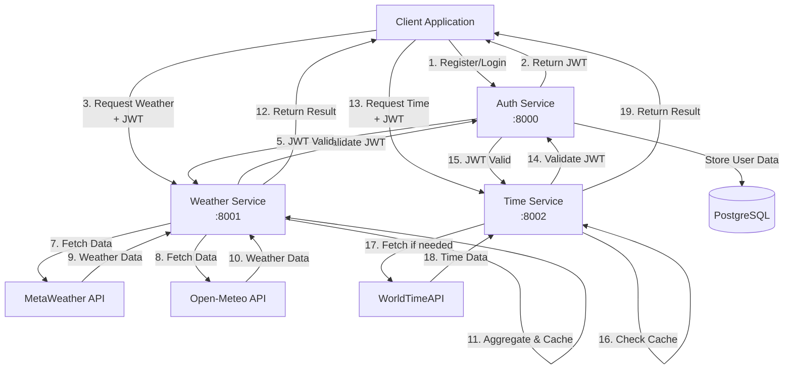
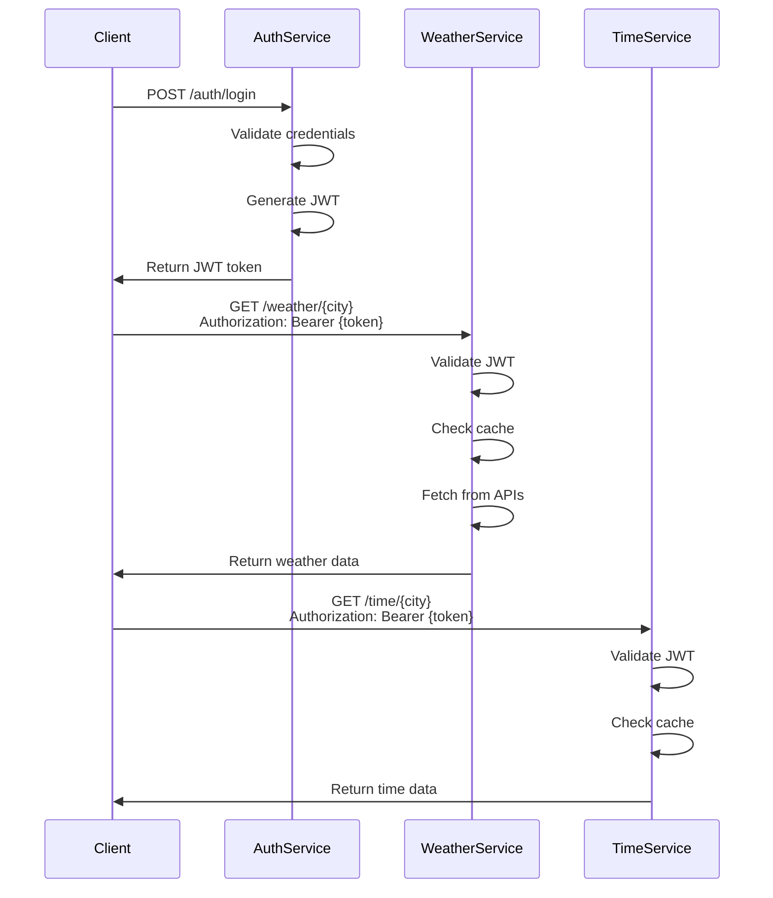
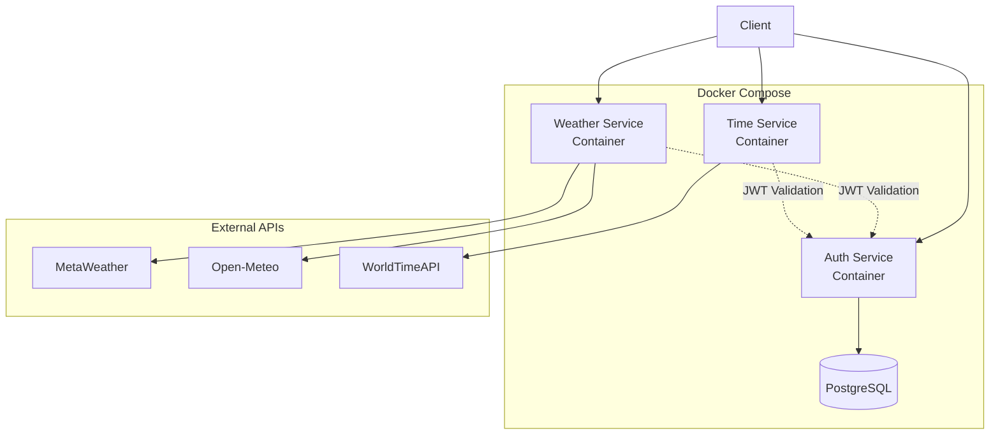

# Architecture Documentation

## System Overview

This project implements a microservices architecture with three separate services that communicate to achieve a common goal:

1. **Auth Service** - Authentication and user management with RBAC
2. **Weather Service** - Aggregates weather data from multiple providers
3. **Time Service** - Provides current time for cities with second accuracy

## Architecture Diagram

## Service Responsibilities

### Auth Service

- **Purpose**: Centralized authentication and authorization
- **Database**: PostgreSQL for user, role, and permission storage
- **Key Features**:
  - JWT token generation and validation
  - User registration and login
  - RBAC (Role-Based Access Control)
  - Admin APIs for user and permission management

**Database Schema:**
- `users` - User accounts
- `roles` - User roles (admin, user)
- `permissions` - Available permissions
- `user_roles` - User-role assignments
- `role_permissions` - Role-permission mappings

### Weather Service

- **Purpose**: Aggregate weather data from multiple free APIs
- **Key Features**:
  - In-memory caching (30-minute TTL)
  - Rate limiting/debouncing for external APIs
  - Data aggregation from multiple providers
  - JWT authentication required

**External APIs:**
- MetaWeather API
- Open-Meteo API

**Caching Strategy:**
- Cache key: `{city_name}`
- TTL: 30 minutes
- In-memory storage using DashMap

**Rate Limiting:**
- Minimum 1 second delay between API calls per provider
- Prevents exceeding API rate limits

### Time Service

- **Purpose**: Provide current time for cities with second accuracy
- **Key Features**:
  - Pre-populated cache on startup
  - Concurrent access with Arc<RwLock>
  - Background refresh task (hourly)
  - JWT authentication required

**External API:**
- WorldTimeAPI.org

**Caching Strategy:**
- Pre-populated with major cities/timezones on startup
- Background refresh every hour
- Concurrent access supported

## Authentication Flow

## Permission Model

### Roles

- **admin**: Has `user:read` and `user:write` permissions
- **user**: Has `weather:read` and `time:read` permissions

### Permissions

- `user:read` - Read user data
- `user:write` - Create/update/delete users
- `weather:read` - Access weather data
- `time:read` - Access time data

### Authorization

- Auth Service admin endpoints require `admin` role
- Weather and Time services only require valid JWT (no permission check)

## Data Flow

### User Registration Flow

1. Client sends registration request to Auth Service
2. Auth Service validates input and checks for duplicates
3. Password is hashed using bcrypt
4. User is created in database
5. Default "user" role is assigned
6. Response returned to client

### Weather Request Flow

1. Client sends request with JWT to Weather Service
2. Weather Service validates JWT
3. Cache is checked for existing data
4. If cache miss, fetch from MetaWeather and Open-Meteo concurrently
5. Rate limiter ensures minimum delay between API calls
6. Data is aggregated (averages, most common values)
7. Result is cached and returned to client

### Time Request Flow

1. Client sends request with JWT to Time Service
2. Time Service validates JWT
3. Cache is checked for timezone data
4. If cache miss, fetch from WorldTimeAPI
5. Data is cached and returned to client

## Deployment Architecture

## Technology Stack

- **Language**: Rust
- **Web Framework**: Actix-web 4.4
- **Async Runtime**: Tokio 1.35
- **Database**: PostgreSQL 16 with SQLx
- **Authentication**: JWT (jsonwebtoken)
- **Password Hashing**: bcrypt
- **HTTP Client**: reqwest
- **Caching**: DashMap (in-memory)
- **Serialization**: serde/serde_json

## Scalability Considerations

- **Stateless Services**: All services are stateless (except cache)
- **Database Connection Pooling**: SQLx connection pool (max 10 connections)
- **Caching**: Reduces external API calls
- **Rate Limiting**: Prevents API abuse
- **Horizontal Scaling**: Services can be scaled independently

## Security Considerations

- **JWT Tokens**: Stateless authentication
- **Password Hashing**: bcrypt with default cost
- **Input Validation**: All inputs validated
- **SQL Injection Prevention**: SQLx compile-time query checking
- **CORS**: Should be configured for production
- **HTTPS**: Should be used in production

